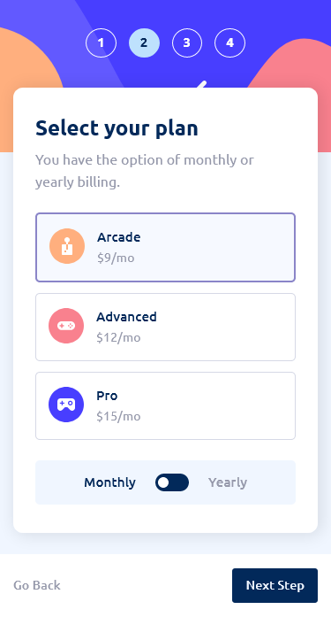

# Frontend Mentor - Multi-step form solution

This is a solution to the [Multi-step form challenge on Frontend Mentor](https://www.frontendmentor.io/challenges/multistep-form-YVAnSdqQBJ). Frontend Mentor challenges help you improve your coding skills by building realistic projects. 

## Table of contents

- [Overview](#overview)
  - [The challenge](#the-challenge)
  - [Screenshot](#screenshot)
  - [Links](#links)
- [My process](#my-process)
  - [Built with](#built-with)
- [Author](#author)

## Overview

### The challenge

Users should be able to:

- [x] Complete each step of the sequence
- [x] See a summary of their selections on the final step and confirm their order
- [x] View the optimal layout for the interface depending on their device's screen size
- [x] See hover and focus states for all interactive elements on the page

### Screenshot

#### Mobile Result

#### Desktop Result

### Links

- Solution URL: [Repository Project](https://github.com/Samuel-Amaro/multi-step-form)
- Live Site URL: [Result Live](https://samuel-amaro.github.io/multi-step-form/)

## My process

### Built with

- Semantic HTML5 markup
- CSS custom properties
- Flexbox
- CSS Grid
- [Normalize CSS](https://necolas.github.io/normalize.css/) - Normalize CSS
- Mobile-first workflow
- RWD(Responsive Web Design)
- JavaScript Programming Language
- [React](https://reactjs.org/) - JS library
  - [Hooks React](https://reactjs.org/docs/hooks-intro.html) - Hooks
- [Bem Metodolody CSS Architecture](https://getbem.com/introduction/) - BEM CSS Architecture
- WebAcessibility with arias attributers, and roles

## Author

- Website - [Portefólio Samuel Amaro](https://samuel-amaro.github.io/portfolio-web/)
- Frontend Mentor - [@Samuel-Amaro](https://www.frontendmentor.io/profile/Samuel-Amaro)

## Execution Project

### Getting Started with Create React App

This project was bootstrapped with [Create React App](https://github.com/facebook/create-react-app).

#### Available Scripts

In the project directory, you can run:

#### `npm start`

Runs the app in the development mode.\
Open [http://localhost:3000](http://localhost:3000) to view it in your browser.

The page will reload when you make changes.\
You may also see any lint errors in the console.

#### `npm test`

Launches the test runner in the interactive watch mode.\
See the section about [running tests](https://facebook.github.io/create-react-app/docs/running-tests) for more information.

#### `npm run build`

Builds the app for production to the `build` folder.\
It correctly bundles React in production mode and optimizes the build for the best performance.

The build is minified and the filenames include the hashes.\
Your app is ready to be deployed!

See the section about [deployment](https://facebook.github.io/create-react-app/docs/deployment) for more information.
